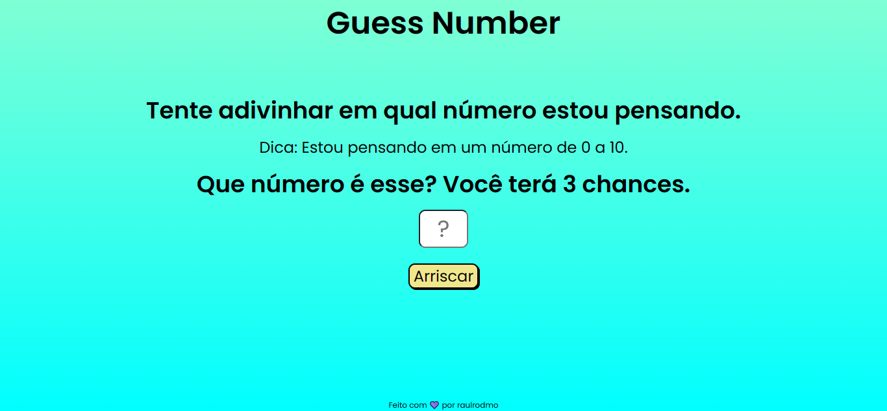

<h1 align="center"> Guess Number </h1>

O repositório demonstra uma brincadeira de adivinhação entre homem e máquina. A máquina gerará um número aleatório de 0 a 10 e o usuário terá 3 chances para descobrir qual o número, caso não acerte o número nas três tentativas, a máquina gerará um novo número e a brincadeira recomeça. 

  <a href="#technologies">Technologies</a>&nbsp;&nbsp;&nbsp;|&nbsp;&nbsp;&nbsp;
  <a href="#project">Project</a>

 

  

## 🚀 Technologies

Esse projeto foi desenvolvido com as seguintes tecnologias:

- HTML e CSS
- JavaScript
- Git e Github

## 💻 Project

- [Visite o projeto online](https://guessnumber-raulrodmo.netlify.app/)

---

Made with 💜 by raulrodmo

